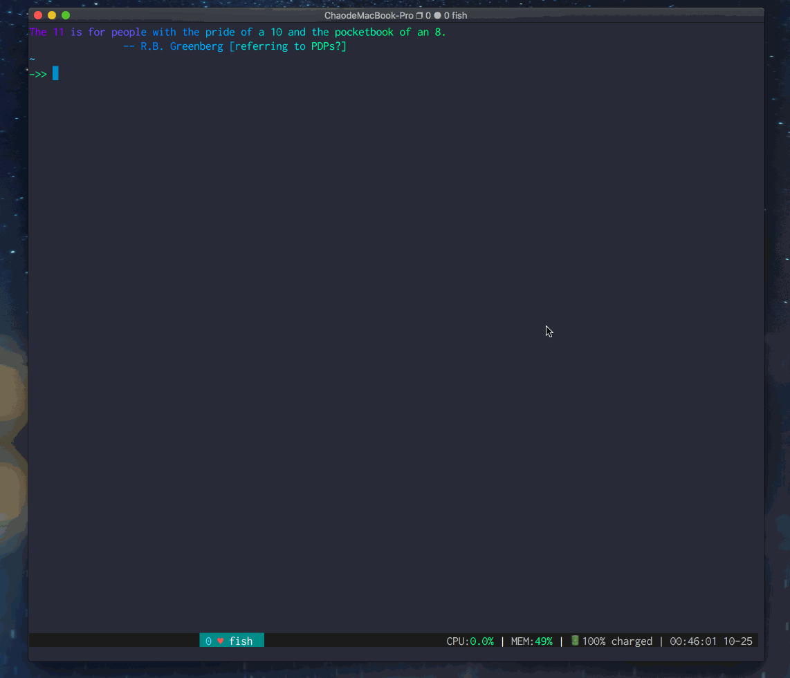

❤ My ~/.dotfiles
================

What's in?
---------

- [fish](https://fishshell.com/) (Best shell, >3)
- [alacritty](https://github.com/jwilm/alacritty) (Fastest terminal emulator, GPU-accelerated.)
- [vim](https://www.vim.org/) (God of editors!)
- [tmux](https://github.com/tmux/tmux) (Coolest terminal multiplexer.)
- [git](https://github.com/git) (Hmm..)

Others
-------

- [z](https://github.com/rupa/z) (Jump faster between directories.)
- [fzf](https://github.com/junegunn/fzf) (Ctrl-R fuzzy finder.)
- [exa](https://github.com/ogham/exa) (Very very fast `ls` replacement.)
- [the_silver_searcher](https://github.com/ggreer/the_silver_searcher) (Much faster than `ack` replacement.)
- [fisher](https://github.com/jorgebucaran/fisher) (Fish shell package manager.)
- [pure-fish](https://github.com/hit9/pure) (My fish theme, forked from [pure](https://github.com/rafaelrinaldi/pure))
- [lolcat](https://github.com/busyloop/lolcat) (Rainbows in terminal.)
- fortune (`brew install fortune`)
- cowsay (`brew install cowsay`)
- [oo](https://github.com/hit9/oo) (Go version manager.)
- [n](https://github.com/tj/n) (Node version manager.)
- [pyenv](https://github.com/pyenv/pyenv) (Python version manager.)

Notes
-----

Feel free to use it for any purpose, but try it at your own risk.
